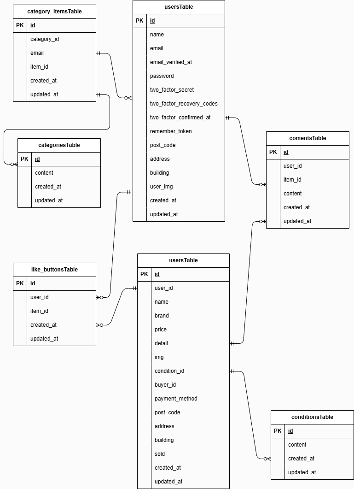

# flea-market

## 環境構築
Dockerビルド
-  1.git clone git@github.com:gigalodo/flea-market.git
-  2.cd flea-market
-  3.docker-compose up -d --build
-  *MySqlは、OSによって起動しない場合があるのでそれぞれの環境に合わせて docker-compose.yml を編集してください。

Laravel環境構築
-  1.docker-compose exec php bash
-  2.composer install
-  3.cp .env.example .env
-  4.envファイルの環境変数を変更
-  5.php artisan key:generate
-  6.php artisan migrate
-  7.php artisan db:seed
-  8.php artisan storage:link

## 使用技術(実行環境)
-  Laravel 8.83.29
-  PHP 8.1
-  mysql 8.0.26

## ER図
 

## URL
-  開発環境：http://localhost/
-  phpMyAdmin：http://localhost:8080
